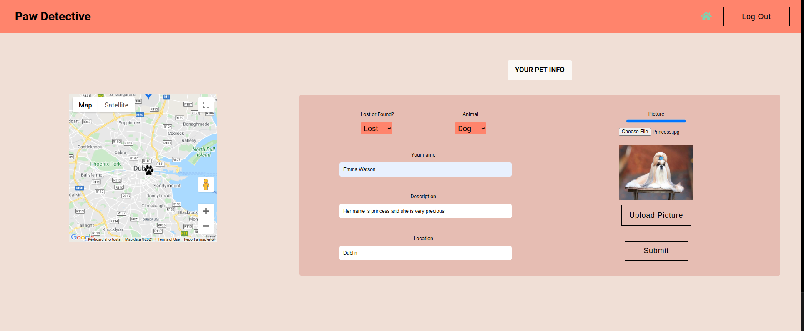

# Paw Detective

Paw Detective is a React Application that helps pet owners reunite with their lost animal friends and on the other side help people that come across a lost animal find its owner and help the pet return home.

Pets are a beloved member of the owner's family. Losing your pet can be overwheling and searching for your friend
can be stressfull. Owners are posting on different platforms and groups on social media, or even on trees! ads about their pet in hope that someone might contact them having good news.

Paw Detective is an app specifically dedicated to helping people bring pets back to their families.

# Preview

# Getting Started

## 1. Clone the Repo

https://github.com/GregaE/PawDetective.git

## 2. Install dependencies

\
 Navigate into the `./client` folder and run `npm install`
\
 Navigate into the `./server` folder and run `npm install`

## 3. Add Enviromental Variables

\
 Within the folder there is an `example.env` file. Copy the variables from that file, paste them on a new `.env` file that you will create locally and fill the variables with your local corresponding values.
\
 Do the same for the `./server` folder.

## 4. Start the app

\
 Run the client by executing `npm start` from inside the client folder.
Run the server by executing `nodemon` from inside the server folder.

# Tech stack

## Front-end

* <a href="https://reactjs.org/">React</a>
* <a href="https://redux.js.org/">Redux</a>
* <a href="https://sass-lang.com/">Sass</a>

## Back-end

* <a href="https://expressjs.com/">Express</a>
* <a href="https://nodejs.org/">Node JS</a>
* <a href="https://www.typescriptlang.org/">Typescript</a>
* <a href="https://mongoosejs.com/">Mongoose</a>
* <a href="https://www.mongodb.com/">MongoDB</a>

## Dependencies & Testing

* <a href="https://jestjs.io/">Jest</a>
* <a href="https://auth0.com/">Auth0</a>
* <a href="https://developers.google.com/maps">Google Maps API</a>
* <a href="https://firebase.google.com/">Firebase storage</a>

# Contributors

- [gregae](https://github.com/GregaE)
- [tomazzobr](https://github.com/TomazzoBr)
- [neocephei](https://github.com/NeoCephei)

This project is a refactor of the original [Paw Detective](https://github.com/Natasa410/PawDetective). Big thanks to [Anastasia](https://github.com/Natasa410/) who created the original project, give her a follow!
